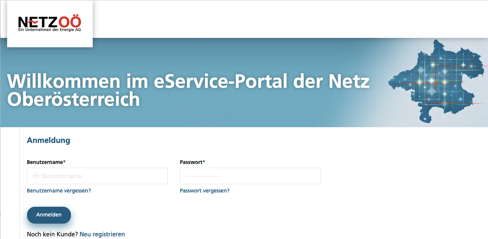
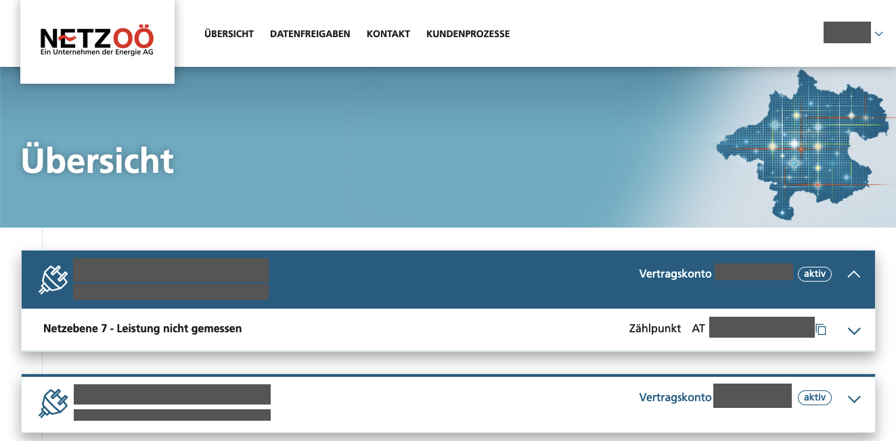
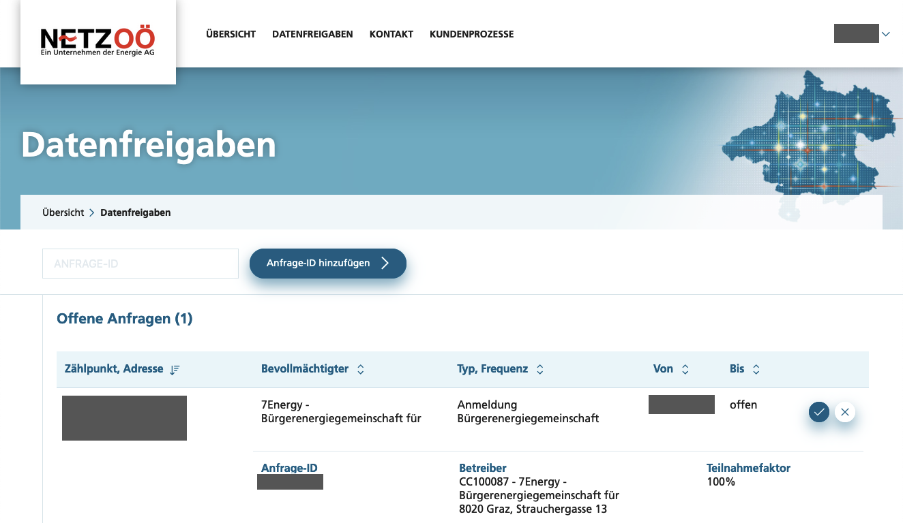
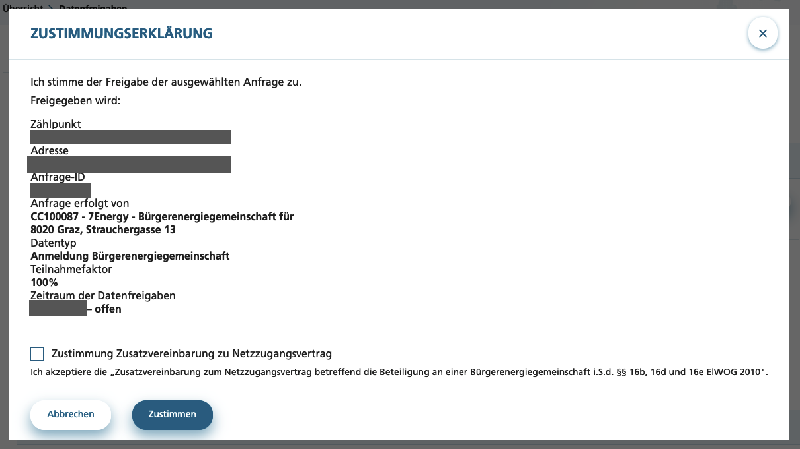
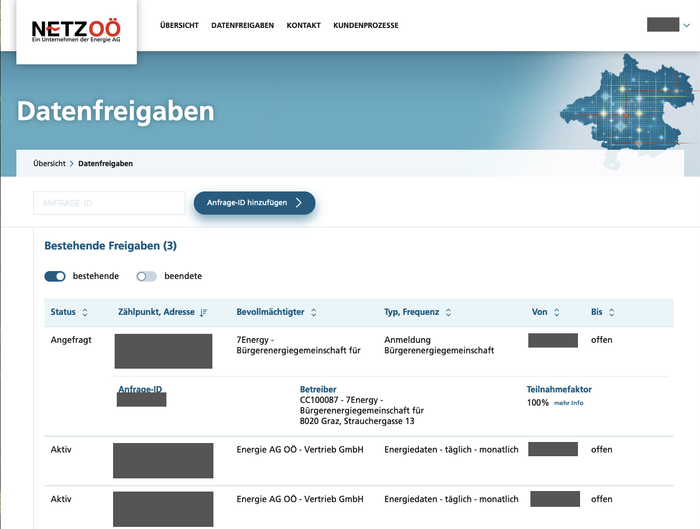

# Netz Oberösterreich

Marktpartner-Details: [https://www.ebutilities.at/marktpartner/14](https://www.ebutilities.at/marktpartner/14)

Netz Oberösterreich betreibt ein Smart Meter Webportal mit Login für ihre Kunden, bei dem man sich zuerst registrieren muss. Die Registrierung benötigt die E-Mail Adresse, Benutzernamen und Kennwort, Zählpunkt, Zählernummer sowie ein zusätzliches Identifikationsmerkmal (am Besten funktioniert die **Kundennummer**, zu finden auf Schreiben von Netz Oberösterreich).

Hier geht es zur Registrierung: [https://eservice.netzooe.at/app/registration](https://eservice.netzooe.at/app/registration)

### 1. Schritt: Einloggen

Du kannst das Smart Meter Webportal über den Login aufrufen: [https://eservice.netzooe.at/app/login](https://eservice.netzooe.at/app/login)

<figure><figcaption></figcaption></figure>

Nach erfolgreichem Login befindest Du Dich auf der Übersichtsseite.

<figure><figcaption></figcaption></figure>

### 2. Schritt: Energiedatenfreigabe

Auf der Übersichtsseite zum Bereich Datenfreigaben wechseln. Hier findest Du bereits getätigte Freigaben sowie die neue Anfrage von 7Energy. Diese bitte mit dem Häkchenbutton erlauben. 
<figure><figcaption></figcaption></figure>

Danach erscheint noch die Zustimmungserklärung, der ebenfalls zugestimmt werden muss.

<figure><figcaption></figcaption></figure>

### 3. Schritt: Kontolle der Freigabe

Nachdem Du die Einwilligung gegeben hast, siehst Du die Freigabe unter "Laufende Freigaben".

<figure><figcaption></figcaption></figure>

### 4. Schritt: Info an 7Energy

Die 7Energy - BEG sollte nun im Hintergrund die Meldung bekommen, dass die Datenfreigabe erfolgt ist. Wenn Du aber auf Nummer Sicher gehen willst, dann schreib uns bitte auch noch eine E-Mail an `office@7energy.at`  damit wir aktiv werden können, sollte etwas bei der Datenübertragung schief gegangen sein.