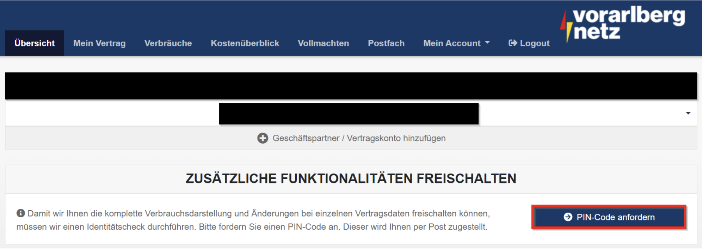

# Vorarlberger Energienetze

Marktpartner-Details: [https://www.ebutilities.at/marktpartner/54](https://www.ebutilities.at/marktpartner/54)

Die Vorarlberger Energienetze stellt ein Kundenportal zur Verfügung, bei welchem man sich zuerst registrieren muss. Nachdem man einen **PIN per Post** erhalten hat, kommt man damit in das eigentliche Portal. &#x20;

Hier geht es direkt zur Registrierung: [https://identity.vorarlbergnetz.at/Identity/RegisterUser](https://identity.vorarlbergnetz.at/Identity/RegisterUser)

### 1. Schritt: PIN Anfordern / Freischalten

Der PIN muss angefordert werden, um das Kundenportal voll freischalten zu können.&#x20;

<figure><figcaption>
Abb. 1: Anforderung PIN Code
</figcaption></figure>

<figure><figcaption>
Abb. 2: Eingabe des angeforderten PIN-Code im Kundenportal
</figcaption></figure>

### 2. Schritt: Datenfreigabe

Die Anfragen werden im Bereich Vollmachten für ca. 6 Wochen hinterlegt und warten auf deine Freigabe. Sollte die Anfrage nicht mehr sichtbar sein, melde dich bitte bei uns, damit wir den Prozess nochmal starten können.&#x20;

<figure><figcaption>
Abb. 3: Vollmachten zur Freigabe im Kundenportal
</figcaption></figure>

### 3. Schritt: Warten auf Abschlussmeldung

Nach deiner Bestätigung werden von der Vorarlberg Netz noch einige Prüfungen durchgeführt und typischerweise bekommen wir nach 1-3 Tagen eine sog. "Abschlussmeldung".&#x20;

Ab diesem Zeitpunkt bist du dann Teil der 7Energy - BEG. :tada:

Solltest du nicht gleich von uns hören, dann frag bitte einfach nach, ob es funktioniert hat. &#x20;
