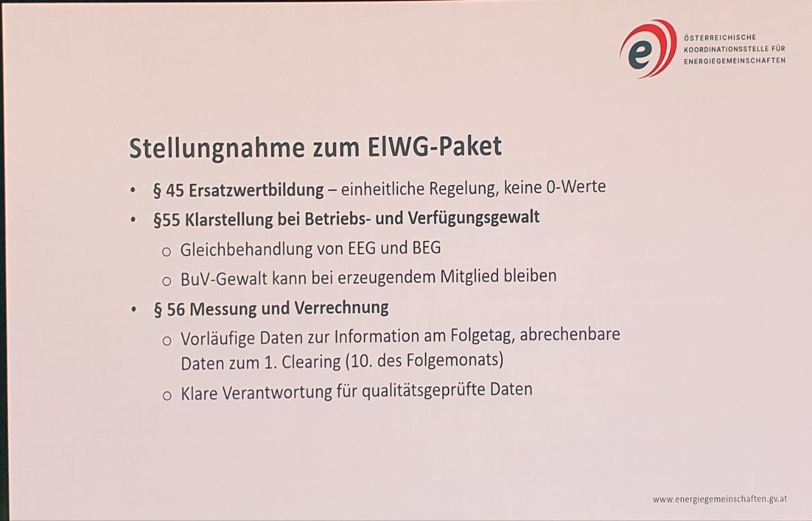

# Protokoll Vorstandsmeeting - 20.03.2024

Ort: Vereinssitz, Strauchergasse 13, 8020 Graz

Datum: 20.03.2024, 12:00 - 13:30

Anwesende: Thomas Zeinzinger, Peter Grassberger&#x20;

Beschlussfähigkeit: 2/2

## Agenda

1. Aufnahme von Volleinspeiseanlagen&#x20;
2. Behandlung von "nur" Einspeisern in der 7Energy - BEG&#x20;

### 1. Aufnahme von Volleinspeiseanlagen&#x20;

Seit dem Beschluss des EAG (Erneuerbaren-Ausbau-Gesetz) im Juli 2021 ist die sog. Betriebs- und Verfügungsgewalt ein immer wiederkehrendes Thema bei Volleinspeiseanlagen, die in die Energiegemeinschaft eingebracht werden.&#x20;

Die rechtliche Lage dazu ist unklar und mit dem ElWG (Elektrizitätswirtschaftsgesetz) ist geplant, hier entsprechend nachzujustieren. Überschusseinspeiseanlagen sollen nun ganz klar beim Betreiber verbleiben, während in aktuellen Begutachtungsentwurf die Volleinspeiser in die Betriebs- und Verfügungsgewalt der Energiegemeinschaft übergehen muss.&#x20;

Inzwischen haben wir aber auf der [Energiegemeinschaften Konferenz](https://www.youtube.com/live/Nq7PRJXv5lM?si=F25S8ZcPpnz4v2by) am 19.03.2024 von [Florian Galler](https://www.youtube.com/live/Nq7PRJXv5lM?si=kPGNes-2IFR0LamW\&t=15322) erfahren, dass es auf EU Ebene bei der [EMD Regulation](https://data.consilium.europa.eu/doc/document/ST-16964-2023-INIT/en/pdf) wahrscheinlich zu Änderungen kommt, die es auch zulassen, dass Mitglieder mit Volleinspeiseanlagen die Betriebs- und Verfügungsgewalt nicht abgeben müssen.

Thomas Z. hat das Thema auch bei der anschließenden [Podiumsdiskussion angesprochen](https://www.youtube.com/live/Nq7PRJXv5lM?si=cATZlWmqg5S\_DFNT\&t=17496) und die Reaktion aus dem Publikum von verschiedenen Vertretern aus der Branche war sehr unterstützend.&#x20;

Auch die Koordinationsstelle für Energiegemeinschaften hat diesen Punkt in ihrer Stellungnahme zur Begutachtung des ElWG eingebracht.&#x20;

<figure><figcaption>
Zusammenfassung der ElWG Stellungnahme durch die Koordinationsstelle für Energiegemeinschaften
</figcaption></figure>

Sollte die 7Energy - BEG eine eigene Anlage errichten, dann hat man natürlich immer die volle Betriebs- und Verfügungsgewalt. Das haben wir aber auf absehbare Zeit nicht vor, weil es mit deutlich mehr Administration und Risiko verbunden ist.    &#x20;

Angesichts des regulatorischen Umfelds, der durchaus hohen Wahrscheinlichkeit des Beschlusses des ElWG vor der Sommerpause 2024 und der hohen Wahrscheinlichkeit eines möglichen Verbleibs der Betriebs- und Verfügungsgewalt von Volleinspeiseanlagen beim Mitglied, sollten wir die Aufnahme von Volleinspeiseanlagen in die 7Energy - BEG noch einmal überdenken.&#x20;

Würden wir es dennoch tun, hätte das weitreichende Folgen:&#x20;

* Steuerpflichten durch Einnahmen aus der übernommenen Anlage müssen entsprechend von der 7Energy - BEG erfüllt werden. Der steuerliche Aufwand würde enorm steigen und wir können davon ausgehen, dass wir neue Fragen aufwerfen würden, die erst mit dem Finanzamt geklärt werden müssten, z.B. wenn eine Anlage noch nicht abgeschrieben ist, darf dann der Restwert in das Anlagevermögen des Vereins aufgenommen werden?
* Bei Volleinspeiseanlagen >500kW müsste der Reststrom selbst vermarktet werden und aktuell ist das bei PV-Volleinspeiseanlagen nur zum Spot-Preis (-Vermarktungsabschläge & Ausgleichsenergiekosten) möglich. Das ist vielfach nicht im Interesse der Eigentümer dieser Anlagen.
* Der Prozess einer Rechtsnachfolge - welchen wir mit einer kleinen 20kWp Volleinspeiseanlage gerade testen, hat mit der OeMAG bisher 3 Monate gedauert. Es ist also ein administrativ aufwendiger und langwieriger Prozess.&#x20;
* Die Buchhaltung würde deutlich an Komplexität dazugewinnen und deutlich mehr Kosten verursachen.&#x20;

**Vorschlag:** Wir nehmen vorläufig keine Volleinspeiseanlagen auf und konzentrieren uns hauptsächlich auf die Überschusseinspeiser bis 500kW Engpassleistung, welche auch einen OeMAG Vertrag bekommen.

**Abstimmungsergebnis:** einstimmig angenommen

### 2. Behandlung von "nur" Einspeisern in der 7Energy - BEG&#x20;

Als 7Energy - BEG müssen wir einerseits darauf achten, dass wir marktkonforme Preise an unsere Erzeuger zahlen und andererseits unsere Verbraucher mit fair bepreisen Ökostrom versorgen können.  &#x20;

Angesichts der schon seit Jänner 2024 wirksam werdenden OeMAG Abschläge auf den E-Control Marktpreis, haben wir auch eine zunehmende Anzahl von "nur" Einspeisern. Da aber vor allem jeder zusätzliche PV-Einspeiser der keine(n) weiteren Verbrauchszählpunkt(e) einbringt, die Absatzquote für andere PV-Einspeiser reduziert, entsteht hier eine zunehmende Unfairness.&#x20;

Dem sollten wir zumindest symbolisch entgegenwirken, damit klar ist, dass "nur" Einspeiser mit volatiler Erzeugung sich nicht voll im Sinne der Energiegemeinschaft beteiligen.&#x20;

Deshalb soll ab Q3/2024 möglichst durchgängig folgende Regelung zur Anwendung kommen: &#x20;

<table><thead><tr><th width="268">volatile Erzeugungsanlage</th><th width="256">volatile Erzeugungsanlage</th><th>stabile Erzeugungsanlage</th></tr></thead><tbody><tr><td>bis 25kW Engpassleistung  z.B. PV auf einem Haus</td><td>>25 - 500kW Engpassleistung z.B. PV auf Industriedach</td><td>bis 500kW Engpassleistung z.B. Kleinwasserkraftwerk</td></tr><tr><td><mark style="color:green;">keine Abschläge</mark> <mark style="color:orange;">(sofern mind. 1 Verbrauchszählpunkt angegeben wurde)</mark></td><td><mark style="color:green;">50 % der OeMAG Abschläge,</mark> <mark style="color:orange;">(sofern mind. 1 Verbrauchszählpunkt angegeben wurde)</mark></td><td><mark style="color:green;">keine Abschläge</mark></td></tr><tr><td><mark style="color:green;">100 % der OeMAG Abschläge</mark> <mark style="color:orange;">(wenn kein weiterer Verbrauchszählpunkt angegeben wurde)</mark></td><td><mark style="color:green;">100 % der OeMAG Abschläge</mark> <mark style="color:orange;">(wenn kein weiterer Verbrauchszählpunkt angegeben wurde)</mark></td><td><mark style="color:green;">keine Abschläge</mark></td></tr></tbody></table>

Damit werden alle Betreiber von kleinen PV-Anlagen weiterhin keine Abschläge haben, sofern sie auch einen oder mehrere Verbrauchszählpunkte in die Energiegemeinschaft einbringen.&#x20;

Alle Betreiber von volatilen "nur" Einspeiseanlagen bekommen trotzdem immer noch eine bessere Vergütung als bei der OeMAG und haben bis Q3/2024 Zeit, weitere Verbrauchs-Zählpunkte in die 7Energy - BEG einzubringen, um nicht mit 100 % der OeMAG Abschläge bei der Abrechnung belegt zu werden.    &#x20;

**Vorschlag:** Umsetzung der 100 % Abschläge für volatile "nur" Einspeiseanlagen. Kommunikation der Änderung als direkte E-Mail an die betroffenen Mitglieder und Aufnahme in die betroffenen Tarifblätter in Q3/2024.   &#x20;

**Abstimmungsergebnis:** einstimmig angenommen
